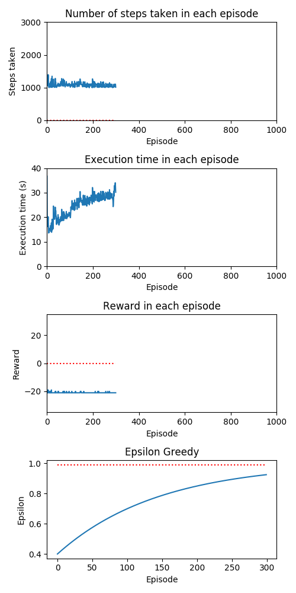
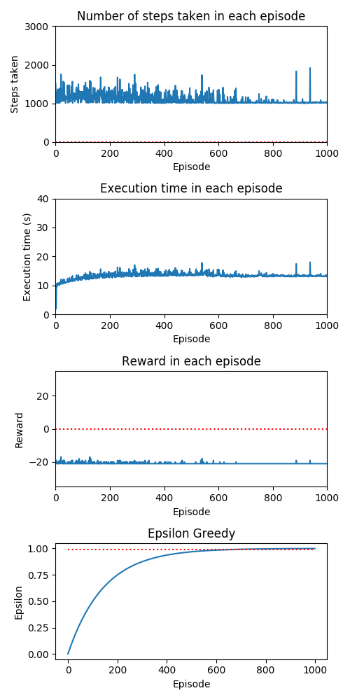

# Pong-v0 \ DQN 

### Graphs and Notes
----------------------------
#### Trial 1

----------------------------
#### Trial 2

----------------------------
#### Trial 3

----------------------------
#### Trial 4

----------------------------
#### Trial 5

----------------------------
#### Trial 6

----------------------------
#### Trial 7

----------------------------
#### Trial 8

Execution time increases at 2000 episodes since the epsilon value is above 0, therefore, exploitation starts. due to exploitation involving the running of the computational graph, the time increases. However, the steps and rewards are seen to decrease as a result of exploitation. 

----------------------------

----------------------------

----------------------------

----------------------------
